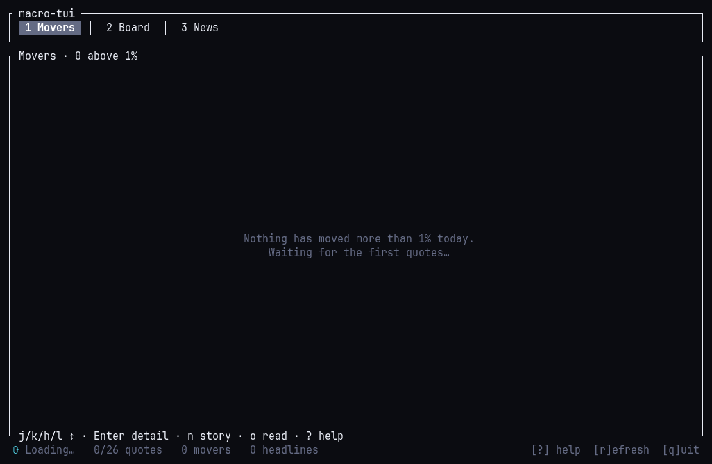
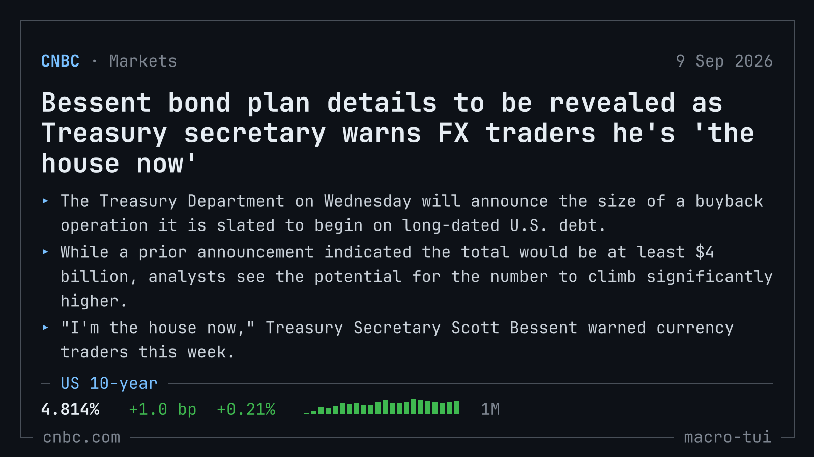

# macro-tui

[jp30566347.github.io/tui/macro-tui](https://jp30566347.github.io/tui/macro-tui)

A macro market overview and the news moving it, in your terminal.

It opens on the day's movers: only the instruments that have gone more than a
percent, each as a card carrying its price, its move and a month of daily
closes, with the one or two macro stories behind the session over them. The
grid reflows to the terminal, from five cards across on a wide one down to a
single column, and a card drops its trend rather than clipping a price when
the space runs out.

Behind that is the whole board. Twenty-six instruments on one screen: US
indices and volatility, Treasury yields and the dollar, commodities, foreign
exchange and crypto, and the G7 world indices. Each row carries a live price,
its move, and a month of daily closes as a trend line. Pick one and get a full
chart plus the headlines that mention it. Pick a headline and read the whole
story without leaving the terminal, or turn it into an image ready to paste
into a post.

There is also the mega-cap tab: the fifteen largest US companies read as one
group rather than as a watchlist. It leads with the day's move weighted by
market capitalisation against the same move with every name counted once,
because when those two diverge the session was carried by a handful of names
and the average company did something else.

No API key, no signup, no configuration. It works the moment it starts.




## Install

```sh
curl -fsSL https://jp30566347.github.io/tui/macro-tui/install.sh | sh
```

Drops a single binary in `~/.local/bin` after verifying its checksum. On Arch
and Omarchy, `makepkg -si` in this directory builds a real package instead.
There are also prebuilt binaries on the [releases page][releases], and
`cargo install --git https://github.com/jp30566347/tui macro-tui` builds from
source.

[releases]: https://github.com/jp30566347/tui/releases

## Keys

| Key | Action |
|---|---|
| `1` `2` `3`, `Tab` | the movers, the board, the news |
| `j` `k`, arrows | move the selection, a whole row at a time on the movers grid |
| `Ctrl-D` `Ctrl-U` | half page down / up |
| `g` `G`, Home/End | first / last |
| `h` `l` | movers: previous / next card. board: jump group. news: cycle section. detail: switch chart range |
| `Enter` | movers, board: open the detail view. news: read the story |
| `n` `N` | movers: pick one of the macro stories. board: scroll the news rail |
| `f` | rail: matched headlines, or the whole pool |
| `o` | read the selected story |
| `c` | copy the selected story as an image, for a post |
| `r` | refresh everything now, or retry a story that failed to load |
| `Esc` | close the story, the detail view or an overlay. Never quits |
| `q`, `Ctrl-C` | quit |

`macro-tui --list-symbols` prints the board. `--tab` picks the starting tab —
1 movers, 2 board, 3 mega caps, 4 news — and `--save-config` remembers it. The
cohort took slot 3 in 0.4.0, so a config written before that now opens on the
mega caps where it used to open on news.

## The mega caps

Fifteen of the largest US companies, and deliberately a cohort rather than a
watchlist: nothing here is about one company, and there is no per-name detail
view.

Two lines sit above the table. The first is the day's move weighted by market
capitalisation beside the same move with every name counted once. When they
diverge the day was narrow, carried by its biggest members while the average
name did less, and the tab says so in a word. The threshold for saying it is
not zero, because two weightings of the same fifteen names differ by basis
points on almost any day and calling that "narrow" would make the word
worthless. The second line is where the group sits in its own year: the median
position in the 52-week band, how many are near their high, and how much of
the cohort's capitalisation its three largest names hold.

Each row then shows where that name sits in its own 52-week band as a filled
bar, how far it is below its 52-week high, and today's volume against its
ten-day average. The bar fills to the position rather than colouring by
direction, so it reads without being able to tell red from green — and so it
is not mistaken for a statement about today's move, which it is not. `h` and
`l` reorder the table by capitalisation, by position in the band, or by the
size of today's move. A dot beside a name means a headline in the pool
mentions it.

Weighting is taken from each name's capitalisation *before* today's move.
Using the reported cap directly would let a name's own gain inflate the weight
that gain is counted at, which biases the cap-weighted figure upward on an up
day — exactly the error that would make the divergence look larger than it is.

The cohort is a hardcoded list reviewed by hand, and the panel title carries
the date it was last checked. An index constituent list is a licensed product,
and over weeks to months the largest names barely change, so a static table is
both cheaper and safer than deriving one.

## The day's movers

The first tab carries only what actually moved: any instrument whose change
since the previous close is more than one percent, biggest move first, whether
it rose or fell. A quiet session leaves it empty, which is itself worth
knowing, so it says so and names the largest move there was.

Each card is the instrument's name, its price, the move in both its own units
and in percent, and a month of daily closes. The grid is laid out to the
terminal it finds: as many cards across as fit comfortably, centred, and a
card that cannot hold a trend loses it before it loses a number. A short
window trades the trends for a second row of cards, because how much of the
day is on screen matters more than the shape of any one move.

Above the cards sit the one or two stories behind the session: the payrolls
number, the inflation print, whatever the Fed said. They are picked out of the
same pool the News tab shows, by the terms that mark a story as macro rather
than as one company's news, and fall back to the newest headlines when the
pool has nothing macro in it. `n` moves between them and `Enter` on a card
opens that instrument's detail view.

## Reading and sharing a story

`Enter` on a headline opens the story in the terminal: CNBC's key points,
then the body, wrapped to a reading measure and scrolled with the usual keys.
Nothing is handed to a browser, so it works over SSH and in a terminal with
nothing else installed.

`c` renders the selected story as a 1600 by 900 image and copies it to the
clipboard, so it can be pasted straight into a post on X or anywhere else that
takes an image. The same file is written under `~/Pictures/macro-tui/` (or the
cache directory on a platform without a pictures folder) for attaching later.
The clipboard holds the image for as long as macro-tui runs; the file stays.



The card is drawn as a terminal window running macro-tui: a plain frame,
the headline, the story's own key points (or the feed's one-line
summary before the story has been opened), and, when the story mentions one
of the board's instruments, that row's price, move and month of closes as a
ticker strip. A story opened from a row is tied to that row when it mentions
it; otherwise the first instrument it mentions, in board order.

## Where the data comes from

| What | Source | Refresh |
|---|---|---|
| Quotes | CNBC, all 26 in one request | 15 s |
| Daily closes | MarketWatch timeseries, all 26 in one request | 15 min |
| Headlines | CNBC top news, economy and finance | 5 min |
| Stories | The CNBC article page, when a headline is opened | cached per session |

All of them are public and keyless. Prices come from the exchanges' own feeds
via CNBC and are real-time for indices; treat them as indicative rather than as
something to trade against.

Only CNBC's feeds are carried because every source has to serve the whole
story to the app. MarketWatch and the FT answer their article pages with a
401 and a 403, so their headlines would have led nowhere.

The app renders to stderr, so stdout stays free and piping it is safe.

## Notes for maintainers

Two things about the upstream endpoints are worth knowing before changing
`src/catalog.rs`.

**A single bad history key fails the whole batch.** The MarketWatch request
carries all twenty-six series and answers a 400 if any one key is
unrecognised. The app recovers by re-probing keys individually and
quarantining the bad one for the rest of the session, but a new row should be
verified first. Run the live checks:

```sh
cargo test -- --ignored --nocapture
```

To find a key, note the country code in MarketWatch's own URL for the
instrument (`/investing/index/dax?countrycode=dx`) and try
`INDEX/<cc>//<TICKER>` and `INDEX/<cc>/<MIC>/<TICKER>`. A wrong key answers in
about 200 ms, so a small grid finds it quickly.

**The quote endpoint's reported percent change is not consistent.** For the
2-year note it carries the change in the bond's *price*, which has the opposite
sign to the change in its yield, so a day when yields rose would render red.
The app recomputes every move from the last price and the previous close and
only falls back to the reported fields when there is no previous close.

The user agent string is also load-bearing: the quote endpoint's CDN answers a
default client string with a 403.

**Stories are read from CNBC's embedded page data.** An article page carries
the document its front end hydrates from as `window.__s_data`, and the reader
takes the story's text from that tree rather than from the markup around it,
which changes with every redesign. The live checks above include one that
opens the newest story in every feed and fails if the body comes back empty.

**The share card's font is compiled in.** `assets/fonts/` holds JetBrains
Mono, regular and bold, subset to Latin plus the box-drawing, block and
geometric-shape ranges the card draws with. It is under the SIL Open Font
License; see the licence file beside it. The renderer sizes text by em, so a
size in the code is the cell height it would be in a terminal.

## License

MIT
